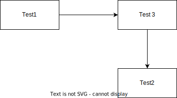
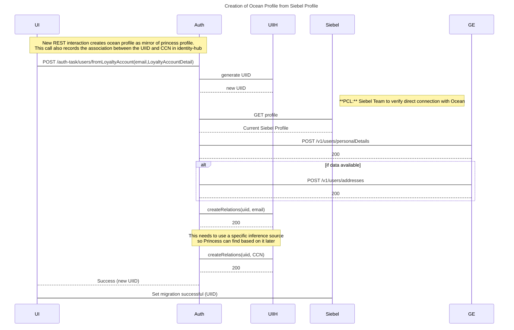

# doc-experiment

A quick github Wiki documetation experiment to show what's possible.

Github .md pages support a lot of formatting.  See the [Writing on Github](https://docs.github.com/en/get-started/writing-on-github/getting-started-with-writing-and-formatting-on-github/quickstart-for-writing-on-github) docs for full details.

However tech docs also require capabilities like:

* Store editable (updatable) image files in the git project, providing any needed picture, and capable of being changed subsequently as needed.
* Serve UML diagrams from a source like PlantUML text.  E.g. easy sequence diagrams.
* Serve OpenAPI specs also hosted in the same repo (ideally in .yaml form)

Here's what I've found:

## Images

[draw.io](https://www.draw.io) is a tool which can be used to create images online.  The resulting images can be saved locally as .png or .svg files.  Both of those in turn support metadata that can be included directly in the file.  This allows the draw.io application to embed the original "source" into the image that is saved so that you can later reload it and make further changes.

Since the saved image ischecked into GitHub you also get the benefit of full version tracking.

This probably works particularly well with saved .svg files, since they are XML text and thus track well with git's "diff" approach to storing deltas.

Here's an example image:

## UML diagrams - PlantUML

Github announced, in a [blog post](https://github.blog/changelog/2022-08-09-wikis-now-support-math-and-mermaid-diagrams/), that they now have support for mermaid, which is very similar to PlantUML, and actually has support for a larger variety of document types.

See [creating diagrams](https://docs.github.com/en/get-started/writing-on-github/working-with-advanced-formatting/creating-diagrams) in the github docs.

With it, you can directly embed sequence diagrams, flowcharts, and other diagram
types into markdown.  You can use the [online editor](https://mermaid.live/edit) to directly edit diagrams, and there is a plugin available for IntelliJ IDEA.

## OpenAPI Specs

I'm not seeing a good way to embed the swagger-ui.html application directly in the Markdown, but you can have links that show an api spec in your github project in the swagger-ui.html browser app.

One aspect of the swagger-ui.html app which is under-appreciated is that it can be given a URL parameter when served.  That parameter will then be used by the javascript of that app to fetch the swagger from the browser and render it.  This makes it easy to use any hosted instance of swagger-ui to serve an openapi spec in github, you just need to provide the github raw URL of the file as the (url encoded) url parameter to the swagger-ui.htl link.

For example, here's a link to the petstore.swager.io demo of swagger-ui.html serving the openapi spec that I've checked into this project:

[Petstore API specification served from this Repo](https://petstore.swagger.io/?url=https%3A%2F%2Fraw.githubusercontent.com%2Fbob-walters%2Fdoc-experiment%2Fmain%2Fdocs%2Fapispec.yaml%3Ftoken%3DGHSAT0AAAAAACEBG7RBFGZNZNW7WNZCBH4CZEN22CQ)

The above works even for private projects since it is your browser (i.e. the js code), and not the swagger.io site which is pulling the spec.

An individual or organization could host an instance of swagger-ui.html on some repo in their organization, via the suggested use of hithub pages (see below), and exploit the approach just mentioned to make it possible to serve UI specs.

Some resources that show how to do this:

* [https://github.com/peter-evans/swagger-github-pages](https://github.com/peter-evans/swagger-github-pages)
* [https://pguso.medium.com/host-openapi-documentation-with-github-pages-ec16f75e9762](https://pguso.medium.com/host-openapi-documentation-with-github-pages-ec16f75e9762) 

The above are all essentially say the same thing:

* embed swagger-ui.html application into your project or organization somewhere.
* serve it via github pages, with the result serving your API.

